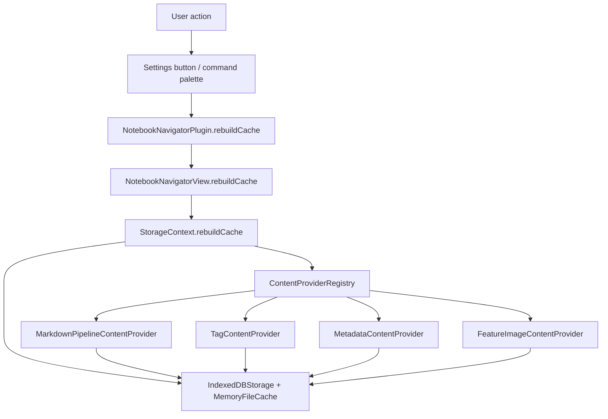
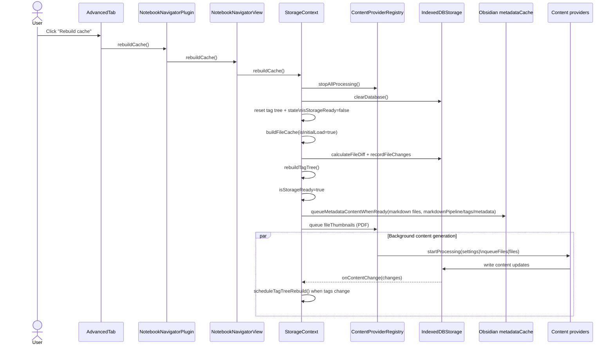
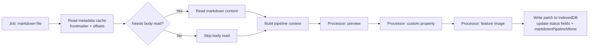

# Notebook Navigator metadata pipeline

Updated: January 8, 2026

## Table of contents

- [Overview](#overview)
- [Pipeline components](#pipeline-components)
- [Full cache rebuild](#full-cache-rebuild)
- [Markdown pipeline stages](#markdown-pipeline-stages)
- [Completion signals](#completion-signals)

## Overview

Notebook Navigator builds a local metadata cache in IndexedDB and mirrors it into an in-memory cache for synchronous reads during rendering.

The cache stores:

- File mtimes plus provider-specific processed mtimes
- Tags, frontmatter-derived metadata, preview status, feature image status/key, and custom property values
- Preview text and feature image blobs in dedicated stores (status fields live in the main record)

## Pipeline components

- `StorageContext` (`src/context/StorageContext.tsx`) owns cache rebuild orchestration, provider queuing, and tag tree rebuild scheduling.
- `IndexedDBStorage` (`src/storage/IndexedDBStorage.ts`) persists file records and emits `onContentChange` events.
- `MemoryFileCache` (`src/storage/MemoryFileCache.ts`) mirrors IndexedDB file records for synchronous access.
- `ContentProviderRegistry` (`src/services/content/ContentProviderRegistry.ts`) runs provider batches and coordinates settings changes.
- Content providers (`src/services/content/*`):
  - `MarkdownPipelineContentProvider` (`markdownPipeline`): preview, custom property, markdown feature images
  - `TagContentProvider` (`tags`): tag extraction from Obsidian metadata cache
  - `MetadataContentProvider` (`metadata`): frontmatter metadata + hidden state
  - `FeatureImageContentProvider` (`fileThumbnails`): non-markdown thumbnails (PDF covers)

## Full cache rebuild

The rebuild flow starts from Settings → Notebook Navigator → Advanced → Rebuild cache (or the `notebook-navigator:rebuild-cache` command).

### What gets queued after the database reset

- `recordFileChanges(...)` writes file records without clearing provider output fields for existing paths. Providers use processed mtimes and status fields to decide what needs regeneration.
- `queueMetadataContentWhenReady(...)` gates metadata-dependent providers (`markdownPipeline`, `tags`, `metadata`) on `app.metadataCache.getFileCache(file)` being available.
- PDF thumbnail generation is queued directly through the registry (`fileThumbnails`).

## Markdown pipeline stages

`MarkdownPipelineContentProvider` runs a processor chain for markdown-derived outputs. Each processor inspects a shared context (settings, file data, frontmatter, optional file content) and returns a partial update.

Body reads are only performed when at least one processor needs content (preview text, word count custom property, or feature image resolution from the note body). Feature image references can be resolved from frontmatter without reading the file body.

## Completion signals

- Storage is ready when `StorageContext` completes the initial diff + tag tree rebuild and sets `isStorageReady=true`.
- A full rebuild is complete when enabled content types have no remaining files with pending status fields (the rebuild notice clears).
