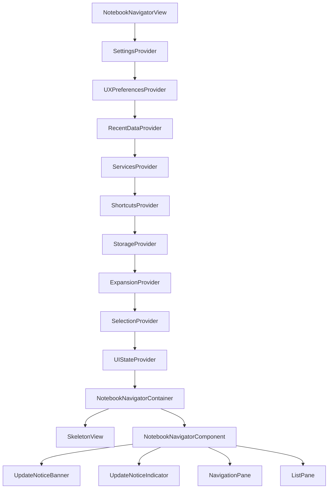
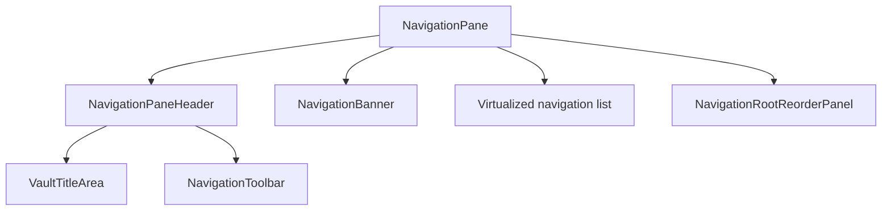
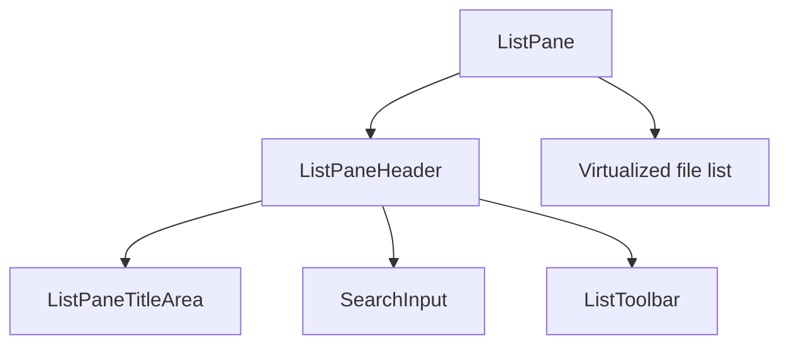
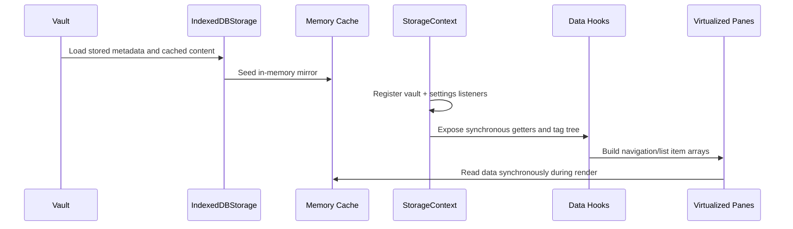
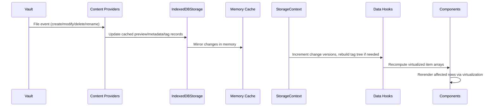
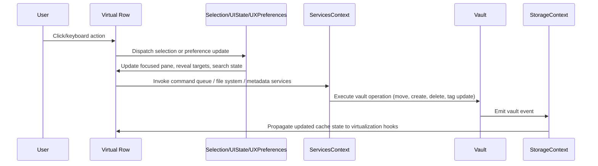

# Notebook Navigator Rendering Architecture

Updated: January 8, 2026

## Table of Contents

- [Overview](#overview)
- [Core Principles](#core-principles)
- [Component Hierarchy](#component-hierarchy)
- [Component Responsibilities](#component-responsibilities)
- [Virtualization Strategy](#virtualization-strategy)
- [Performance Optimizations](#performance-optimizations)
- [Data Flow](#data-flow)
- [Scroll Management System](#scroll-management-system)

## Overview

The Notebook Navigator plugin renders a React application inside an Obsidian `ItemView`. The UI is split into navigation
and list panes that both use `@tanstack/react-virtual` to keep rendering costs stable even in large vaults. Storage is
mirrored through `StorageContext`, which wraps `IndexedDBStorage`, the in-memory cache, and the content provider queue
so that components read preview data, metadata, and tag trees synchronously during render.

Context providers isolate concerns such as settings, runtime preferences, recent data, services, shortcuts, expansion
state, selection state, and pane layout. Derived data and behaviours live in dedicated hooks, leaving components to
focus on presentation and wiring.

## Core Principles

### 1. Virtualized Panes

`useNavigationPaneScroll` and `useListPaneScroll` wrap `useVirtualizer` from `@tanstack/react-virtual`. These hooks own
the scroll containers, gate rendering on container visibility, keep version counters for list rebuilds, and queue scroll
intents (reveal requests, navigation jumps, configuration changes) so they run only after the corresponding virtual
items exist.

### 2. Synchronous Storage Mirror

`StorageContext` (`src/context/StorageContext.tsx`) coordinates `IndexedDBStorage`, the `ContentProviderRegistry`, and
the memory mirror. Components call helpers such as `getFile`, `getFiles`, `getTagTree`, `getFileDisplayName`,
`getFileCreatedTime`, `hasPreview`, and `findTagInTree` directly during render. Cache updates are dispatched by vault
events, settings changes, and background content providers, keeping virtualization deterministic.

### 3. Derived Data Hooks

Expensive data shaping lives outside component bodies. Examples:

- `useNavigationPaneData` builds the combined folder/tag/shortcut tree, computes note counts, resolves icons and
  colours, and tracks virtual folders, banners, pinned shortcuts, and section ordering.
- `useNavigationRootReorder` exposes drag-and-drop reorder state and render helpers for root folders, tags, and section
  headers.
- `useListPaneData` assembles list pane items (pinned files, top spacer, date headers, search metadata, hidden item
  flags) and keeps lookup maps for virtualized scrolling and multi-selection.
- `useListPaneAppearance`, `useListPaneTitle`, `useNavigationPaneKeyboard`, `useListPaneKeyboard`, `useNavigatorReveal`,
  and `useNavigatorEventHandlers` encapsulate behaviour that would otherwise live inside components.

### 4. Context-Based State Layers

Nine providers wrap the React tree:

- `SettingsContext` – persisted plugin settings and mutation helpers
- `UXPreferencesContext` – runtime-only preferences (search active, include descendant notes, show hidden items, pin
  shortcuts)
- `RecentDataContext` – recent notes list and recent icon history sourced from local storage
- `ServicesContext` – Obsidian app handles plus command queue, file system helpers, metadata services, tag tree service,
  and plugin API bridge
- `ShortcutsContext` – pinned shortcut hydration, add/remove/reorder operations, and lookup maps
- `StorageContext` – IndexedDB mirror, tag tree, synchronous metadata accessors, cache rebuild entry points
- `ExpansionContext` – expanded folders, tags, shortcuts, recent notes, and virtual folders
- `SelectionContext` – selected folder/tag/file, multi-selection tracking, reveal targets, and selection dispatchers
- `UIStateContext` – pane mode (single vs dual), focused pane, current single-pane view, navigation pane width, pinned
  shortcuts toggle

### 5. Stable Rendering Contracts

Heavy components (`NavigationPane`, `ListPane`, `FolderItem`, `TagTreeItem`, `FileItem`, `ShortcutItem`,
`VirtualFolderComponent`) use `React.memo` with stable props. Event handlers are memoized with `useCallback`, derived
class names and counts use `useMemo`, and DOM measurements (navigation item height, indentation, scale transforms) are
applied via effects in `NotebookNavigatorComponent` and `useNavigatorScale` so render output stays pure.

## Component Hierarchy

### Top-level stack



### NavigationPane subtree



### ListPane subtree



## Component Responsibilities

### NotebookNavigatorView

**Location**: `src/view/NotebookNavigatorView.tsx`

- Creates the React root, applies mobile platform classes, and mounts the provider stack
  (`Settings → UXPreferences → RecentData → Services → Shortcuts → Storage → Expansion → Selection → UIState`).
- Exposes imperative handlers to the plugin (cache rebuild, reveal actions, folder/tag modal navigation, search toggle,
  delete/move operations, shortcut creation).
- Dispatches `notebook-navigator-visible` on mobile when the drawer becomes visible so scroll hooks can resume pending
  reveal operations.
- Cleans up container classes and unmounts the React tree on view close.

### NotebookNavigatorContainer

**Location**: `src/components/NotebookNavigatorContainer.tsx`

- Reads `isStorageReady` from `StorageContext` and pane mode from `UIStateContext`.
- Applies the scale wrapper returned by `useNavigatorScale`, using desktop/mobile scale preferences from settings.
- Restores the saved navigation pane size for the active orientation via `localStorage` helpers and
  `getNavigationPaneSizing`.
- Chooses between the skeleton layout and `NotebookNavigatorComponent`, ensuring layout parity (single vs dual pane,
  orientation, search state) while storage warms up.

### SkeletonView

**Location**: `src/components/SkeletonView.tsx`

- Mirrors the active layout with placeholder panes, respecting vertical vs horizontal splits and single-pane mode.
- Shows a search bar placeholder when search is enabled through `UXPreferences`.
- Adapts navigation pane size using the stored `paneSize` so virtualization keeps consistent offsets after hydration.

### NotebookNavigatorComponent

**Location**: `src/components/NotebookNavigatorComponent.tsx`

- Wires selection, settings, services, shortcuts, UX preferences, and storage into pane components.
- Manages pane sizing and drag handles via `useResizablePane`, propagating resize props to `ListPane`.
- Shares a root container ref with both panes for keyboard handling and focus tracking.
- Runs `useNavigatorReveal`, `useNavigatorEventHandlers`, `useNavigationActions`, `useMobileSwipeNavigation`,
  `useTagNavigation`, and `useUpdateNotice` to provide navigation commands, swipe gestures, tag cycling, and update
  notices.
- Applies CSS custom properties for navigation item height, indentation, and font sizes once per settings change.
- Renders `UpdateNoticeBanner`, `UpdateNoticeIndicator`, `NavigationPane` (with banner and reorder panel), and
  `ListPane` in the correct pane arrangement (single or dual).

### NavigationPaneHeader

**Location**: `src/components/NavigationPaneHeader.tsx`

- Desktop header providing dual/single pane toggle, profile menu trigger, expand/collapse all, hidden item toggle, root
  reorder toggle, and new folder action.
- Mobile variant renders a simplified profile menu trigger when multiple profiles exist.
- Defers tree-refresh callbacks with `requestAnimationFrame` so scroll hooks can remeasure after batch operations.

### NavigationToolbar

**Location**: `src/components/NavigationToolbar.tsx`

- Mobile toolbar providing expand/collapse, hidden item toggle, root reorder toggle, and new folder action.
- Rendered at the top on Android and the bottom on iOS.

### NavigationPane

**Location**: `src/components/NavigationPane.tsx`

- Consumes data from `useNavigationPaneData`, `useNavigationRootReorder`, `useNavigationPaneScroll`,
  and `useNavigationPaneKeyboard`.
- Renders header/banner/pinned sections above a virtualized `CombinedNavigationItem[]` list; renders
  `NavigationRootReorderPanel` instead of the virtual list when root reorder mode is active.
- Handles folder/tag drag targets and uses dnd-kit sortable contexts for shortcut reordering.
- Integrates context menus (`buildFolderMenu`, `buildTagMenu`, `buildFileMenu`) and frontmatter exclusion logic for
  hidden items.
- Measures the chrome overlay height and passes it to the scroll hook as `scrollMargin` so `scrollToIndex` aligns items
  below the overlay.

### NavigationBanner

**Location**: `src/components/NavigationBanner.tsx`

- Resolves the configured banner file from the vault, renders it above the navigation list, and reports height changes
  via `ResizeObserver` so the virtualizer adjusts offsets.

### NavigationRootReorderPanel

**Location**: `src/components/NavigationRootReorderPanel.tsx`

- Displays reorderable sections, folder lists, and tag lists when root reorder mode is active.
- Provides drop indicators, drag handle labels, and reset buttons that reset root ordering to alphabetical defaults.
- Updates scroll container data attributes to reflect drop targets for visual feedback.

### ListPaneHeader

**Location**: `src/components/ListPaneHeader.tsx`

- Desktop header showing breadcrumb title (with optional icon), search toggle, descendant toggle, sort menu, appearance
  menu, and new note button.
- Mobile variant shows a back button to the navigation pane and renders breadcrumb segments horizontally scrollable with
  fade indicators.
- Uses `useListPaneTitle` to build the breadcrumb segments and `useListActions` for button handlers.

### ListToolbar

**Location**: `src/components/ListToolbar.tsx`

- Mobile toolbar (top on Android, bottom on iOS) exposing search, descendant toggle, sort, appearance, and new note
  actions.
- Shares command logic with the header through `useListActions`.

### ListPane

**Location**: `src/components/ListPane.tsx`

- Consumes data and behaviour from `useListPaneData`, `useListPaneScroll`, `useListPaneKeyboard`,
  `useListPaneAppearance`, `useMultiSelection`, `useContextMenu`, and `useFileOpener`.
- Renders the search bar (`SearchInput`), `ListPaneTitleArea`, mobile toolbars, empty states, and the virtual list with
  top spacer, date headers, file rows, and bottom spacer.
- Integrates Omnisearch results when configured, including excerpt matches and highlight metadata.
- Maintains drop-zone attributes for drag-and-drop moves and exposes scroll handlers for reveal operations and search
  reset behaviour.
- Persists search active state through `UXPreferences` and debounces input before triggering expensive filtering.

### FileItem

**Location**: `src/components/FileItem.tsx`

- Renders file title, Omnisearch highlights, preview text, feature image, tag pills, parent folder label, and date
  metadata based on appearance settings and optimization flags.
- Subscribes to content updates from `IndexedDBStorage` to refresh preview text, tags, feature image, and hidden state.
- Provides quick actions (reveal, pin/unpin, open in new tab) on desktop hover and handles drag-and-drop metadata for
  file moves.
- Uses `createHiddenTagVisibility` to mark files shown via “show hidden items”.

### FolderItem

**Location**: `src/components/FolderItem.tsx`

- Displays folder name, icon, colours, note counts, folder note indicator, and tooltip counts.
- Handles expand/collapse, selection, sibling toggles (Alt+click), context menus, and hidden/excluded state rendering.
- Sets Obsidian icons in `useEffect` to avoid blocking React renders and updates tooltips only on desktop.

### TagTreeItem

**Location**: `src/components/TagTreeItem.tsx`

- Renders hierarchical tags with indentation, note counts (current vs descendants), tag icons/colours, and missing-state
  styles for hidden tags.
- Supports expand/collapse, context menus, tag reveal, drag-and-drop, and optional shortcut drag handles.

### ShortcutItem

**Location**: `src/components/ShortcutItem.tsx`

- Presents folder, note, search, and tag shortcuts with labels, counts, drag handles, and missing indicators.
- Shares styling with navigation rows through `NavigationListRow` and participates in dnd-kit sortable reordering.

### RootFolderReorderItem

**Location**: `src/components/RootFolderReorderItem.tsx`

- Specialized `NavigationListRow` wrapper for root reorder mode with drag handles and reset actions.
- Supports folders, tags, and section headers, including missing-item styling, inside dnd-kit sortable lists.

## Virtualization Strategy

### Navigation Pane Virtualization

- `useNavigationPaneData` returns `items: CombinedNavigationItem[]` plus lookup maps (`pathToIndex`, `shortcutIndex`) and
  pinned-section arrays (`shortcutItems`, `pinnedRecentNotesItems`) used by the chrome overlay.
- `NavigationPane` renders the chrome overlay (header/banner/pinned sections) above the virtual list and measures its
  height; that value is passed as `scrollMargin` so virtualizer alignment stays below the overlay.
- `useNavigationPaneScroll` initializes the virtualizer with `NAVPANE_MEASUREMENTS` and exposes `requestScroll` for reveal
  operations.
- `NavigationPane` maps `rowVirtualizer.getVirtualItems()` to components, switching on `item.type` to render the correct
  row (`FolderItem`, `TagTreeItem`, `VirtualFolderComponent`, `ShortcutItem`, recent note rows, spacers).
- Root reorder mode swaps the virtual list for `NavigationRootReorderPanel` (non-virtualized), which renders
  `RootFolderReorderItem` rows.
- Path-to-index maps and shortcut index maps are kept in `useNavigationPaneData` and shared with the scroll hook to
  resolve scroll targets at execution time.

```typescript
const { items, pathToIndex, shortcutIndex, shortcutItems } = useNavigationPaneData({
  settings,
  activeProfile,
  isVisible: navigationVisible,
  shortcutsExpanded,
  recentNotesExpanded,
  pinShortcuts,
  sectionOrder
});

const { rowVirtualizer, scrollContainerRefCallback, requestScroll } = useNavigationPaneScroll({
  items,
  pathToIndex,
  isVisible: navigationVisible,
  activeShortcutKey,
  scrollMargin: navigationOverlayHeight
});
```

### List Pane Virtualization

- `useListPaneData` emits `ListPaneItem[]` composed of top/bottom spacers, date headers, and file items with pinned and
  hidden flags plus lookup maps (`filePathToIndex`, `fileIndexMap`).
- `useListPaneScroll` feeds `listItems` into `useVirtualizer`, calculating heights with `getListPaneMeasurements`,
  preview availability (`hasPreview`), search metadata, and appearance settings. The list overlay height is passed as
  `scrollMargin` so `scrollToIndex` aligns items below the header/search chrome.
- The hook maintains a priority queue of pending scrolls (reveal, navigation, visibility change, search) and runs them
  after the index version matches the expected rebuild.
- `ListPane` renders virtual items by switching on `item.type` and passing search metadata to `FileItem`; headers are
  inline `<div className="nn-date-group-header">` nodes, matching the measurement logic.

```typescript
const { listItems, filePathToIndex, orderedFiles } = useListPaneData({
  selectionType,
  selectedFolder,
  selectedTag,
  settings,
  activeProfile,
  searchProvider,
  searchQuery: isSearchActive ? debouncedSearchQuery : undefined,
  searchTokens: isSearchActive ? debouncedSearchTokens : undefined,
  visibility: { includeDescendantNotes, showHiddenItems }
});

const { rowVirtualizer, scrollContainerRefCallback, handleScrollToTop } = useListPaneScroll({
  listItems,
  filePathToIndex,
  selectedFile,
  selectedFolder,
  selectedTag,
  settings,
  folderSettings: appearanceSettings,
  isVisible,
  selectionState,
  selectionDispatch,
  searchQuery: isSearchActive ? debouncedSearchQuery : undefined,
  suppressSearchTopScrollRef,
  topSpacerHeight,
  includeDescendantNotes,
  scrollMargin: listOverlayHeight
});
```

## Performance Optimizations

### 1. Scroll-Oriented Hooks

`useNavigationPaneScroll` and `useListPaneScroll` keep pending scroll intents, overscan settings, and index version
counters. Both hooks watch container visibility (via `ResizeObserver`) to avoid failed virtualizer calls when panes are
hidden (mobile drawers, dual-pane toggles).

### 2. Derived Data Caches

`useNavigationPaneData` and `useListPaneData` debounce vault-driven rebuilds with `debounce` from Obsidian, reuse `Map`
instances for lookup tables, and return shortcut/selection metadata so `React.memo` components receive stable props.
`StorageContext` batches diff calculations, content provider queues, and tag tree rebuilds so UI components only react
to finalized updates.

### 3. Memoized Components

Virtualized row components (`FolderItem`, `TagTreeItem`, `ShortcutItem`, `FileItem`) memoize expensive derived values
(class names, tooltip data, highlight ranges, tag colours) and rely on stable props to avoid unnecessary renders. Parent
components memoize handler factories and service descriptors to keep prop identity stable.

### 4. Debounced User Input

Search queries are debounced before triggering data rebuilds, Omnisearch requests use token-based cancellation, and
modal open actions defer heavy work with `setTimeout` only when background scheduling is required.

### 5. CSS Variables and Scale

Navigation item height, indentation, and font sizes are written to CSS custom properties once per settings change,
keeping render output pure. `useNavigatorScale` applies global scaling for the navigator wrapper rather than
recalculating layout inside virtualized items.

## Data Flow

### Initial Render



### File Change



### User Interaction



## Scroll Management System

Detailed scroll orchestration for both panes (intent queues, version gating, reveal flows) is documented in
`docs/scroll-orchestration.md`.
