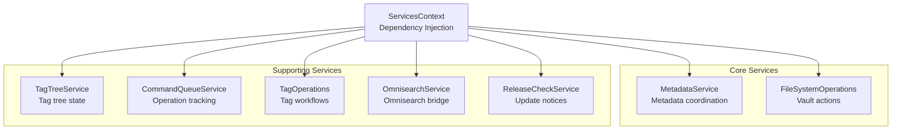
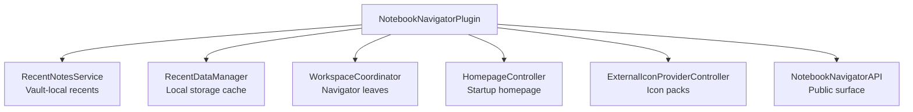
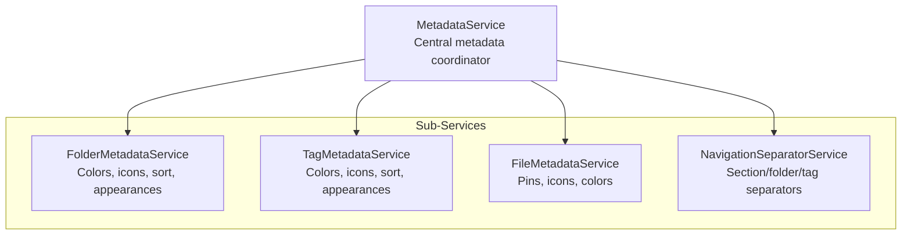
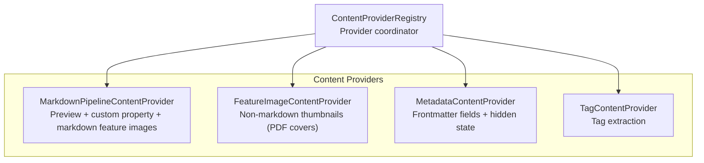

# Notebook Navigator Service Architecture

Updated: January 8, 2026

## Table of Contents

- [Overview](#overview)
- [Service Hierarchy](#service-hierarchy)
- [Core Services](#core-services)
- [Plugin-Managed Services](#plugin-managed-services)
- [Supporting Services](#supporting-services)
- [Dependency Injection](#dependency-injection)
- [Service Initialization](#service-initialization)
- [Data Flow](#data-flow)
- [Service Patterns](#service-patterns)

## Overview

The service layer hosts business logic that coordinates between the storage system and the React UI. Services
encapsulate vault mutations, metadata lifecycle, background processing, and integration points so UI components remain
declarative.

Most UI code accesses services through `ServicesContext`. The provider exposes the Obsidian `app`, the plugin instance,
a mobile flag, and the plugin-managed singletons:

- `fileSystemOps` (`FileSystemOperations`)
- `metadataService` (`MetadataService`)
- `tagOperations` (`TagOperations`)
- `tagTreeService` (`TagTreeService`)
- `commandQueue` (`CommandQueueService`)
- `omnisearchService` (`OmnisearchService`)
- `releaseCheckService` (`ReleaseCheckService`)

These instances are created during plugin startup and remain singletons for the lifetime of the plugin. Nullable entries
must be guarded while the plugin is still initializing. `IconService` is a global singleton accessed through
`getIconService()`. `StorageContext` owns the background content pipeline through `ContentProviderRegistry` and does not
publish the registry via `ServicesContext`.

See `docs/metadata-pipeline.md` for the cache rebuild flow and the content provider processing pipeline.

## Service Hierarchy

### ServicesContext



### Plugin-Managed Services



### Metadata Service Structure



### Content Provider Registry Structure



`ContentProviderRegistry` is owned by `StorageContext`. The registry and its providers are created when storage mounts
and are not exposed through `ServicesContext`.

## Core Services

### MetadataService

Central coordinator for folder, tag, and file metadata. Delegates to specialized sub-services and mirrors frontmatter
state into settings when requested.

**Location:** `src/services/MetadataService.ts`

**Responsibilities:**

- Folder metadata: colors, background colors, icons, sort overrides, custom appearances, folder note metadata detection.
- Tag metadata: colors, background colors, icons, sort overrides, custom appearances.
- File metadata: pinned notes, icons, colors, frontmatter migration helpers, iconize conversion support.
- Navigation separators: section, folder, and tag separator entries.
- Metadata cleanup and summary reporting based on vault state.
- Rename and delete coordination for folders, tags, and files.

**Sub-Services:**

- **FolderMetadataService** (`src/services/metadata/FolderMetadataService.ts`)
  - Validates folder existence, manages colors/backgrounds/icons, honors inheritance settings.
  - Updates metadata paths on rename and delete.
  - Cleans stale entries with diff validators.

- **TagMetadataService** (`src/services/metadata/TagMetadataService.ts`)
  - Tracks tag colors/backgrounds/icons/sort overrides.
  - Normalizes tag casing and propagates changes to nested paths.
  - Uses tag tree snapshots for cleanup.

- **FileMetadataService** (`src/services/metadata/FileMetadataService.ts`)
  - Manages pinned notes per folder/tag context.
  - Stores file icons and colors with frontmatter fallback and migration.
  - Updates metadata during file rename/delete and syncs with IndexedDB cache.

- **NavigationSeparatorService** (`src/services/metadata/NavigationSeparatorService.ts`)
  - Persists separators for navigation sections, folders, and tags.
  - Updates separator keys on folder/tag rename and delete.
  - Cleans stale entries during metadata cleanup and exposes a versioned subscription.

**Key APIs:**

```typescript
// Folder metadata
setFolderColor(folderPath: string, color: string): Promise<void>
setFolderBackgroundColor(folderPath: string, color: string): Promise<void>
removeFolderColor(folderPath: string): Promise<void>
removeFolderBackgroundColor(folderPath: string): Promise<void>
getFolderColor(folderPath: string): string | undefined
getFolderBackgroundColor(folderPath: string): string | undefined
setFolderIcon(folderPath: string, iconId: string): Promise<void>
removeFolderIcon(folderPath: string): Promise<void>
getFolderIcon(folderPath: string): string | undefined
setFolderSortOverride(folderPath: string, sortOption: SortOption): Promise<void>
removeFolderSortOverride(folderPath: string): Promise<void>
getFolderSortOverride(folderPath: string): SortOption | undefined
handleFolderRename(oldPath: string, newPath: string): Promise<void>
handleFolderDelete(folderPath: string): Promise<void>

// Tag metadata
setTagColor(tagPath: string, color: string): Promise<void>
setTagBackgroundColor(tagPath: string, color: string): Promise<void>
removeTagColor(tagPath: string): Promise<void>
removeTagBackgroundColor(tagPath: string): Promise<void>
getTagColor(tagPath: string): string | undefined
getTagBackgroundColor(tagPath: string): string | undefined
setTagIcon(tagPath: string, iconId: string): Promise<void>
removeTagIcon(tagPath: string): Promise<void>
getTagIcon(tagPath: string): string | undefined
handleTagRename(oldPath: string, newPath: string, preserveExisting?: boolean): Promise<void>
handleTagDelete(tagPath: string): Promise<void>
setTagSortOverride(tagPath: string, sortOption: SortOption): Promise<void>
removeTagSortOverride(tagPath: string): Promise<void>
getTagSortOverride(tagPath: string): SortOption | undefined

// Navigation separators
getNavigationSeparators(): Record<string, boolean>
hasNavigationSeparator(target: NavigationSeparatorTarget): boolean
addNavigationSeparator(target: NavigationSeparatorTarget): Promise<void>
removeNavigationSeparator(target: NavigationSeparatorTarget): Promise<void>
getNavigationSeparatorsVersion(): number
subscribeToNavigationSeparatorChanges(listener: (version: number) => void): () => void

// File metadata
togglePin(filePath: string, context: NavigatorContext): Promise<void>
pinNotes(filePaths: string[], context: NavigatorContext): Promise<number>
isFilePinned(filePath: string, context?: NavigatorContext): boolean
getPinnedNotes(context?: NavigatorContext): string[]
setFileIcon(filePath: string, iconId: string): Promise<void>
removeFileIcon(filePath: string): Promise<void>
getFileIcon(filePath: string): string | undefined
setFileColor(filePath: string, color: string): Promise<void>
removeFileColor(filePath: string): Promise<void>
getFileColor(filePath: string): string | undefined
migrateFileMetadataToFrontmatter(): Promise<FileMetadataMigrationResult>
handleFileDelete(filePath: string): Promise<void>
handleFileRename(oldPath: string, newPath: string): Promise<void>

// Cleanup utilities
cleanupAllMetadata(targetSettings?: NotebookNavigatorSettings): Promise<boolean>
cleanupTagMetadata(targetSettings?: NotebookNavigatorSettings): Promise<boolean>
runUnifiedCleanup(validators: CleanupValidators, targetSettings?: NotebookNavigatorSettings): Promise<boolean>
getCleanupSummary(): Promise<MetadataCleanupSummary>
MetadataService.prepareCleanupValidators(app: App, tagTree?: Map<string, TagTreeNode>): CleanupValidators
```

### FileSystemOperations

Handles all vault mutations triggered from the navigator, including confirmation modals, selection updates, and command
queue integration.

**Location:** `src/services/FileSystemService.ts`

**Responsibilities:**

- File and folder creation, rename, deletion, duplication.
- Folder note conversion with conflict handling.
- Batch file moves with modal workflows and smart selection updates.
- Canvas/base drawing creation and reveal helpers.
- Command queue tracking for deletes and moves.
- System actions such as reveal in explorer and version history.

**Key Methods:**

```typescript
createNewFolder(parent: TFolder, onSuccess?: (path: string) => void): Promise<void>
createNewFile(parent: TFolder): Promise<TFile | null>
renameFolder(folder: TFolder, settings?: NotebookNavigatorSettings): Promise<void>
renameFile(file: TFile): Promise<void>
deleteFolder(folder: TFolder, confirmBeforeDelete: boolean, onSuccess?: () => void): Promise<void>
deleteFile(file: TFile, confirmBeforeDelete: boolean, onSuccess?: () => void, preDeleteAction?: () => Promise<void>): Promise<void>
deleteSelectedFile(
  file: TFile,
  settings: NotebookNavigatorSettings,
  selectionContext: SelectionContext,
  selectionDispatch: SelectionDispatch,
  confirmBeforeDelete: boolean
): Promise<void>
duplicateNote(file: TFile): Promise<void>
duplicateFolder(folder: TFolder): Promise<void>
isDescendant(parent: TAbstractFile, child: TAbstractFile): boolean

moveFilesToFolder(options: MoveFilesOptions): Promise<MoveFilesResult>
moveFilesWithModal(
  files: TFile[],
  selectionContext?: {
    selectedFile: TFile | null;
    dispatch: SelectionDispatch;
    allFiles: TFile[];
  }
): Promise<void>
moveFolderWithModal(
  folder: TFolder
): Promise<
  | { status: 'success'; data: MoveFolderResult }
  | { status: 'cancelled' }
  | { status: 'error'; error: unknown }
>

convertFileToFolderNote(file: TFile, settings: NotebookNavigatorSettings): Promise<void>

deleteMultipleFiles(
  files: TFile[],
  confirmBeforeDelete: boolean,
  preDeleteAction?: () => void | Promise<void>
): Promise<void>
deleteFilesWithSmartSelection(
  selectedFiles: Set<string>,
  allFiles: TFile[],
  selectionDispatch: SelectionDispatch,
  confirmBeforeDelete: boolean
): Promise<void>

createCanvas(parent: TFolder): Promise<TFile | null>
createBase(parent: TFolder): Promise<TFile | null>
createNewDrawing(parent: TFolder, type?: 'excalidraw' | 'tldraw'): Promise<TFile | null>

openVersionHistory(file: TFile): Promise<void>
getRevealInSystemExplorerText(): string
revealInSystemExplorer(file: TFile | TFolder): Promise<void>
```

### ContentProviderRegistry

Coordinates background content providers that populate IndexedDB mirrors used by the UI. Owned by `StorageContext`.

**Location:** `src/services/content/ContentProviderRegistry.ts`

**Responsibilities:**

- Provider registration and lookup.
- Settings change coordination, including clearing content and notifying providers.
- Batching queues across providers with optional include/exclude filters.
- Stopping provider processing during teardown.

**Registry Methods:**

```typescript
registerProvider(provider: IContentProvider): void
getProvider(type: ContentProviderType): IContentProvider | undefined
getAllProviders(): IContentProvider[]
getAllRelevantSettings(): (keyof NotebookNavigatorSettings)[]
handleSettingsChange(oldSettings: NotebookNavigatorSettings, newSettings: NotebookNavigatorSettings): Promise<ContentProviderType[]>
queueFilesForAllProviders(
  files: TFile[],
  settings: NotebookNavigatorSettings,
  options?: { include?: ContentProviderType[]; exclude?: ContentProviderType[] }
): void
stopAllProcessing(): void
```

**Content Providers:**

- **MarkdownPipelineContentProvider** (`src/services/content/MarkdownPipelineContentProvider.ts`)
  - Generates markdown-derived content in a single pass (preview text, custom property, markdown feature images).
  - Uses Obsidian's metadata cache for frontmatter and frontmatter position offsets.

- **FeatureImageContentProvider** (`src/services/content/FeatureImageContentProvider.ts`)
  - Generates thumbnails for non-markdown files (PDF cover thumbnails).

- **MetadataContentProvider** (`src/services/content/MetadataContentProvider.ts`)
  - Extracts configured frontmatter metadata fields and hidden state based on vault profile exclusions.

- **TagContentProvider** (`src/services/content/TagContentProvider.ts`)
  - Extracts tags from Obsidian's metadata cache (`getAllTags(metadata)`).
  - Deduplicates case variants and stores values without the `#` prefix.

## Plugin-Managed Services

These services live on the plugin instance and are surfaced to React code through specialized contexts or helper
methods.

### RecentNotesService

**Location:** `src/services/RecentNotesService.ts`

**Responsibilities:**

- Maintains the recent notes list stored in vault-local storage.
- Deduplicates entries, enforces configurable limits, and preserves ordering.
- Provides helpers for open, rename, and delete events.

**Key Methods:**

```typescript
recordFileOpen(file: TFile): boolean
renameEntry(oldPath: string, newPath: string): boolean
removeEntry(path: string): boolean
```

### RecentDataManager

**Location:** `src/services/recent/RecentDataManager.ts`

**Responsibilities:**

- Wraps `RecentStorageService` lifecycle for vault-local storage of recent notes and icons.
- Hydrates data during plugin startup and notifies listeners on change.
- Applies limits and handles flushing pending persisting tasks.

**Key Methods:**

```typescript
initialize(activeVaultProfileId: string): void
dispose(): void
getRecentNotes(): string[]
setRecentNotes(recentNotes: string[]): void
applyRecentNotesLimit(): void
getRecentIcons(): Record<string, string[]>
setRecentIcons(recentIcons: Record<string, string[]>): void
flushPendingPersists(): void
```

### ExternalIconProviderController

**Location:** `src/services/icons/external/ExternalIconProviderController.ts`

**Responsibilities:**

- Manages install/update/removal flow for external icon packs.
- Downloads assets, stores them in `IconAssetDatabase`, and registers providers with `IconService`.
- Syncs provider enablement with plugin settings and bundled manifests.

**Key Methods:**

```typescript
initialize(): Promise<void>
dispose(): void
installProvider(id: ExternalIconProviderId, options?: InstallOptions): Promise<void>
removeProvider(id: ExternalIconProviderId, options?: RemoveOptions): Promise<void>
syncWithSettings(): Promise<void>
isProviderInstalled(id: ExternalIconProviderId): boolean
isProviderDownloading(id: ExternalIconProviderId): boolean
getProviderVersion(id: ExternalIconProviderId): string | null
```

### WorkspaceCoordinator

**Location:** `src/services/workspace/WorkspaceCoordinator.ts`

**Responsibilities:**

- Ensures navigator leaves exist and are revealed.
- Coordinates manual and contextual reveal actions for files across all navigator instances.

**Key Methods:**

```typescript
activateNavigatorView(): Promise<WorkspaceLeaf | null>
getNavigatorLeaves(): WorkspaceLeaf[]
revealFileInActualFolder(file: TFile, options?: RevealFileOptions): void
revealFileInNearestFolder(file: TFile, options?: RevealFileOptions): void
```

### HomepageController

**Location:** `src/services/workspace/HomepageController.ts`

**Responsibilities:**

- Resolves configured homepage files, applies mobile overrides, and opens them at startup or via command.
- Works with `WorkspaceCoordinator` and `CommandQueueService` to open files and reveal them in the navigator.
- Handles deferred triggers while the workspace loads.

**Key Methods:**

```typescript
resolveHomepageFile(): TFile | null
handleWorkspaceReady(options: { shouldActivateOnStartup: boolean }): Promise<void>
open(trigger: 'startup' | 'command'): Promise<boolean>
```

### NotebookNavigatorAPI

**Location:** `src/api/NotebookNavigatorAPI.ts`

Provides the typed public API surface for external integrations. Exposes metadata, navigation, and selection helpers
built on top of the core services.

## Supporting Services

### TagTreeService

Bridge between React storage state and non-React consumers that need tag data.

**Location:** `src/services/TagTreeService.ts`

**Responsibilities:**

- Stores latest tag tree snapshot and tagged/untagged counts.
- Provides lookup helpers used by services outside React.

**Key Methods:**

```typescript
updateTagTree(tree: Map<string, TagTreeNode>, tagged: number, untagged: number): void
getTagTree(): Map<string, TagTreeNode>
getUntaggedCount(): number
getTaggedCount(): number
findTagNode(tagPath: string): TagTreeNode | null
getAllTagPaths(): string[]
collectTagPaths(node: TagTreeNode): Set<string>
```

### CommandQueueService

Tracks in-flight operations so React code can batch updates and adjust behavior during complex flows.

**Location:** `src/services/CommandQueueService.ts`

**Responsibilities:**

- Records move/delete operations, folder note opens, version history opens, new context opens, active file opens, and
  homepage loads.
- Provides `onOperationChange` subscription for UI hooks.
- Ensures sequential execution and consistent state tracking.

**Operation Types:**

```typescript
enum OperationType {
  MOVE_FILE = 'move-file',
  DELETE_FILES = 'delete-files',
  OPEN_FOLDER_NOTE = 'open-folder-note',
  OPEN_VERSION_HISTORY = 'open-version-history',
  OPEN_IN_NEW_CONTEXT = 'open-in-new-context',
  OPEN_ACTIVE_FILE = 'open-active-file',
  OPEN_HOMEPAGE = 'open-homepage'
}
```

**Key Methods:**

```typescript
onOperationChange(listener: (type: OperationType, active: boolean) => void): () => void
hasActiveOperation(type: OperationType): boolean
getActiveOperations(): Operation[]
clearAllOperations(): void

isMovingFile(): boolean
isDeletingFiles(): boolean
isOpeningFolderNote(): boolean
isOpeningHomepage(): boolean
isOpeningVersionHistory(): boolean
isOpeningInNewContext(): boolean

executeMoveFiles(
  files: TFile[],
  targetFolder: TFolder
): Promise<CommandResult<{ movedCount: number; skippedCount: number; errors: { filePath: string; error: unknown }[] }>>
executeDeleteFiles(files: TFile[], performDelete: () => Promise<void>): Promise<CommandResult>
executeOpenFolderNote(folderPath: string, openFile: () => Promise<void>): Promise<CommandResult>
executeOpenVersionHistory(file: TFile, openHistory: () => Promise<void>): Promise<CommandResult>
executeOpenInNewContext(file: TFile, context: PaneType, openFile: () => Promise<void>): Promise<CommandResult>
executeOpenActiveFile(file: TFile, openFile: () => Promise<void>): Promise<CommandResult<{ skipped: boolean }>>
executeHomepageOpen(file: TFile, openFile: () => Promise<void>): Promise<CommandResult>
```

### TagOperations

Facade for tag operations across the vault.

**Location:** `src/services/TagOperations.ts`

**Responsibilities:**

- Adds tags while preventing duplicates and ancestor conflicts.
- Removes single tags or clears all tags from files.
- Renames and deletes tags using modal workflows and file mutations.
- Updates tag metadata and shortcuts after tag rename/delete operations.
- Emits tag rename/delete events to registered listeners.
- Reads cached tags from IndexedDB to build tag summaries.

**Key Methods:**

```typescript
addTagRenameListener(listener: (payload: TagRenameEventPayload) => void): () => void
addTagDeleteListener(listener: (payload: TagDeleteEventPayload) => void): () => void
addTagToFiles(tag: string, files: TFile[]): Promise<{ added: number; skipped: number }>
removeTagFromFiles(tag: string, files: TFile[]): Promise<number>
clearAllTagsFromFiles(files: TFile[]): Promise<number>
getTagsFromFiles(files: TFile[]): string[]
promptRenameTag(tagPath: string): Promise<void>
promoteTagToRoot(sourceTagPath: string): Promise<void>
renameTagByDrag(sourceTagPath: string, targetTagPath: string): Promise<void>
promptDeleteTag(tagPath: string): Promise<void>
```

### OmnisearchService

Optional integration with the community Omnisearch plugin.

**Location:** `src/services/OmnisearchService.ts`

**Responsibilities:**

- Detects the Omnisearch API through plugin manager or global scope.
- Executes full-text searches and normalizes result data.
- Registers indexing callbacks when Omnisearch is available.

**Key Methods:**

```typescript
isAvailable(): boolean
search(query: string): Promise<OmnisearchHit[]>
registerOnIndexed(callback: () => void): void
unregisterOnIndexed(callback: () => void): void
```

### IconService

Global singleton that coordinates icon providers and rendering.

**Location:** `src/services/icons/IconService.ts`

**Responsibilities:**

- Registers bundled providers (Lucide, Emoji).
- Manages search, validation, formatting, and recent icons.
- Works with `ExternalIconProviderController` for downloadable packs.

**Icon Providers:**

- Built-in: `LucideIconProvider`, `EmojiIconProvider`
- Downloadable: `BootstrapIconProvider`, `FontAwesomeIconProvider`, `MaterialIconProvider`, `PhosphorIconProvider`,
  `RpgAwesomeIconProvider`, `SimpleIconsProvider`

**Key Methods:**

```typescript
registerProvider(provider: IconProvider): void
unregisterProvider(providerId: string): void
getProvider(providerId: string): IconProvider | undefined
getAllProviders(): IconProvider[]
parseIconId(iconId: string): ParsedIconId
formatIconId(provider: string, identifier: string): string
renderIcon(container: HTMLElement, iconId: string, size?: number): void
isValidIcon(iconId: string): boolean
search(query: string, providerId?: string): IconDefinition[]
getAllIcons(providerId?: string): IconDefinition[]
getRecentIcons(): string[]
```

### ReleaseCheckService

**Location:** `src/services/ReleaseCheckService.ts`

**Responsibilities:**

- Polls GitHub releases and compares versions with the installed plugin.
- Stores timestamps and latest announced releases in settings.
- Provides pending notices consumed by the React UI.

**Key Methods:**

```typescript
checkForUpdates(force?: boolean): Promise<ReleaseUpdateNotice | null>
getPendingNotice(): ReleaseUpdateNotice | null
clearPendingNotice(): void
```

## Dependency Injection

Services rely on light-weight interfaces to avoid tight coupling to the plugin class.

### ISettingsProvider

**Location:** `src/interfaces/ISettingsProvider.ts`

```typescript
interface ISettingsProvider {
  readonly settings: NotebookNavigatorSettings;
  saveSettingsAndUpdate(): Promise<void>;
  notifySettingsUpdate(): void;
  getRecentNotes(): string[];
  setRecentNotes(recentNotes: string[]): void;
  getRecentIcons(): Record<string, string[]>;
  setRecentIcons(recentIcons: Record<string, string[]>): void;
  getRecentColors(): string[];
  setRecentColors(recentColors: string[]): void;
}
```

### ITagTreeProvider

**Location:** `src/interfaces/ITagTreeProvider.ts`

```typescript
interface ITagTreeProvider {
  getAllTagPaths(): string[];
}
```

`TagTreeService` implements the interface and surfaces additional helpers for internal use.

### IContentProvider

**Location:** `src/interfaces/IContentProvider.ts`

```typescript
interface IContentProvider {
  getContentType(): ContentProviderType;
  getRelevantSettings(): (keyof NotebookNavigatorSettings)[];
  shouldRegenerate(oldSettings: NotebookNavigatorSettings, newSettings: NotebookNavigatorSettings): boolean;
  clearContent(context?: ContentProviderClearContext): Promise<void>;
  queueFiles(files: TFile[]): void;
  startProcessing(settings: NotebookNavigatorSettings): void;
  stopProcessing(): void;
  waitForIdle(): Promise<void>;
  onSettingsChanged(settings: NotebookNavigatorSettings): void;
}
```

## Service Initialization

Services are instantiated during plugin startup (see `docs/startup-process.md`, phase 1):

```typescript
// Database and settings load happen before this block
this.initializeRecentDataManager();
this.recentNotesService = new RecentNotesService(this);

// Initialize workspace and homepage coordination
this.workspaceCoordinator = new WorkspaceCoordinator(this);
this.homepageController = new HomepageController(this, this.workspaceCoordinator);

// Initialize services
this.tagTreeService = new TagTreeService();
this.metadataService = new MetadataService(this.app, this, () => this.tagTreeService);
this.tagOperations = new TagOperations(
  this.app,
  () => this.settings,
  () => this.tagTreeService,
  () => this.metadataService
);
this.commandQueue = new CommandQueueService(this.app);
this.fileSystemOps = new FileSystemOperations(
  this.app,
  () => this.tagTreeService,
  () => this.commandQueue,
  (): VisibilityPreferences => ({
    includeDescendantNotes: this.uxPreferences.includeDescendantNotes,
    showHiddenItems: this.uxPreferences.showHiddenItems
  }),
  this
);
this.omnisearchService = new OmnisearchService(this.app);
this.api = new NotebookNavigatorAPI(this, this.app);
this.releaseCheckService = new ReleaseCheckService(this);

const iconService = getIconService();
this.externalIconController = new ExternalIconProviderController(this.app, iconService, this);
const iconController = this.externalIconController;
if (iconController) {
  runAsyncAction(
    async () => {
      await iconController.initialize();
      await iconController.syncWithSettings();
    },
    {
      onError: (error: unknown) => {
        console.error('External icon controller init failed:', error);
      }
    }
  );
}
```

React mounts the navigator with dependency injection:

```tsx
<SettingsProvider plugin={plugin}>
  <UXPreferencesProvider plugin={plugin}>
    <RecentDataProvider plugin={plugin}>
      <ServicesProvider plugin={plugin}>
        <ShortcutsProvider>
          <StorageProvider app={plugin.app} api={plugin.api}>
            {/* Navigator providers and UI */}
          </StorageProvider>
        </ShortcutsProvider>
      </ServicesProvider>
    </RecentDataProvider>
  </UXPreferencesProvider>
</SettingsProvider>
```

`StorageProvider` creates the `ContentProviderRegistry` and registers all providers when storage becomes ready.

## Data Flow

### Content Generation Flow

1. **File Detection**: `StorageContext` picks files needing processing and calls `queueFilesForAllProviders`. Providers
   skip files without enabled features and dedupe the queue.
2. **Queue Management**: `BaseContentProvider` batches up to 100 files and processes them with a parallel limit of 10,
   respecting debounce timers and abort signals.
3. **Processing**: Providers read vault data and produce updates:
   - Tags via `app.metadataCache.getFileCache()`
   - Preview text via `app.vault.cachedRead()`
   - Feature images via frontmatter then embedded resources
   - Metadata via `extractMetadataFromCache` plus hidden-state checks against exclusion rules
4. **Database Updates**: Providers call `IndexedDBStorage` batch APIs (`batchUpdateFileContent`,
   `batchClearAllFileContent`).
5. **Memory Sync**: `MemoryFileCache` mirrors IndexedDB updates for synchronous access.
6. **UI Updates**: `StorageContext` listens for database events, rebuilds the tag tree, and updates React contexts.

### Metadata Cleanup Flow

Triggered manually from **Settings → Notebook Navigator → Advanced → Clean up metadata**.

1. **Validator Preparation**: `MetadataService.prepareCleanupValidators()` collects vault files, folders, and the
   current tag tree.
2. **Cleanup Execution**: `MetadataService.runUnifiedCleanup()` removes orphaned folder, tag, file, pinned note, and
   navigation separator entries using the validators.
3. **Persistence**: When changes are detected, settings are saved via `saveSettingsAndUpdate()`.
4. **Feedback**: UI shows cleanup results obtained from `MetadataService.getCleanupSummary()`.

### File Operation Flow

1. User initiates an operation (create, rename, move, delete, duplicate).
2. `FileSystemOperations` gathers input through modals when required.
3. `CommandQueueService` wraps long-running operations (moves, deletes, reveals, homepage opens).
4. Vault operations execute through `app.vault` or `app.fileManager`.
5. Selection state updates via helpers from `selectionUtils`.
6. `StorageContext` observes vault events, records changes into IndexedDB, and rebuilds the tag tree.
7. React contexts broadcast changes to the UI.

## Service Patterns

- **Singleton**: `IconService` and plugin-managed services are singleton instances; each mounted `StorageProvider` owns a `ContentProviderRegistry`.
- **Provider**: Content providers and icon providers use pluggable registries for extensibility.
- **Delegation**: `MetadataService` delegates specialized work to folder/tag/file/separator sub-services.
- **Bridge**: `TagTreeService` bridges StorageContext data to non-React consumers.
- **Observer**: `CommandQueueService`, recent data listeners, and `subscribeToNavigationSeparatorChanges()` publish state changes to the UI.
